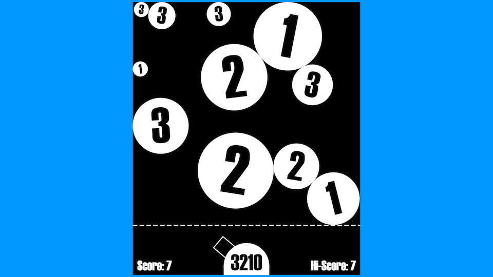

# Sweet Sweet Friction

Current demo can be seen [here](https://martimatix.github.io/sweet-sweet-friction/).

## Getting started

You need to have [Elm](http://elm-lang.org/) 0.18 installed on your machine.

It is helpful to have [elm-live](https://github.com/tomekwi/elm-live) installed on your machine for live reloading.

Compile and run this project with:

    elm-live src/Main.elm --output=elm.js --open

## About

This game is based on Wouter Visser's *Gimme Friction Baby* written in Flash.
